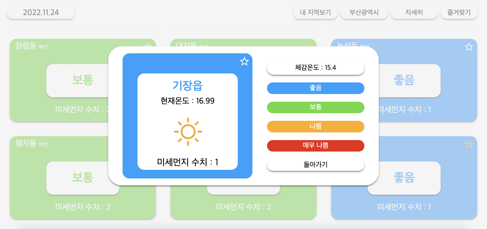

# 미세먼지 알리미

지역별 미세먼지 데이터를 제공하는 프로젝트

## 사용한 API

* 공공데이터 포털 미세먼지 API(한국환경공단_에어코리아_대기오염정보)를 이용해 지역별 미세먼지 수치 데이터 사용

* openweathermap API(Current Weather Data)를 이용해 지역별 기온 데이터 사용

* Kakao maps API를 이용해 좌표를 지역으로 변환

## 구현한 기능

* 지역 선택시 선택한 지역의 미세먼지와 기온을 보여준다.

* 원하는 지역을 즐겨찾기로 등록/삭제할 수 있다.

* API를 통해 데이터를 가져오는 동안 로딩 아이콘을 보여준다.

* '내 지역보기'를 통해 현재 위치의 데이터를 확인할 수 있다.

